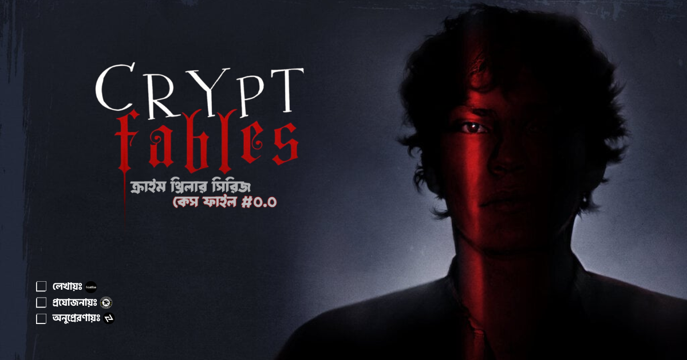

import FirstSubpost from '@/components/mdx/FirstSubpost.astro'

> আমি তখন বুঝিনি যে মানুষ শুধু মারা গেলে ভূত হয় না। মানুষ তার নাম, চেহারা, আর অস্তিত্ব হারালেও ভূত হয়ে যায়।

---

### [দৃশ্য 1: শেষ রাতের ট্রেন]

**সময়:** রাত ৩:১৫  
**লোকেশন:** ঢাকার কমলাপুর রেলস্টেশন, এক প্ল্যাটফর্মের এক কোণে।

ল্যাপটপটা আমার কোলে। স্ক্রিন থেকে বের হওয়া নীল আলোয় আমার ক্লান্ত মুখ স্পষ্ট দেখা যাচ্ছে। রেডক্রিপ্টের (Redcrypt) মূল সার্ভার থেকে আমার অ্যাক্টিভিটির সব লগ মুছে দিয়েছি। এখন বাকি শুধু আমার নিজের জীবন থেকে নিজেকে মুছে ফেলা।

শেষ রাতের ট্রেনটা হুইসেল বাজিয়ে চলে গেল। আমি ট্রেন থেকে বের হয়ে পুরানো এক ল্যাপটপ ভাঙা শুরু করলাম। প্রথমে স্ক্রিন, তারপর হার্ড ড্রাইভ। হার্ড ড্রাইভটাকে আমি একটা প্লাস্টিকের ব্যাগে নিলাম, এবং যখন ট্রেনটি ঢাকার উপকণ্ঠ দিয়ে একটি নদীর উপর দিয়ে পার হচ্ছে, তখন সেটাকে ছুঁড়ে ফেললাম পানিতে।

> সেদিন আমি শিখেছিলাম, প্রযুক্তির শেষ চিহ্নটা মুছে ফেলতেও মানুষের আবেগ দরকার হয়।

---

### [দৃশ্য 2: সদরঘাটের এক নৌকো]

**সময়:** ভোর ৫টা  
**লোকেশন:** ঢাকা সদরঘাট, এক ছোট নৌকো

আশেপাশে সবাই নতুন দিনের প্রস্তুতি নিচ্ছে। আমি একা বসে আছি একটা পুরোনো লঞ্চের এক কোনায়। লঞ্চটা যাচ্ছে ভোলার দিকে।

আমার পকেটে একটি নতুন পাসপোর্ট, নতুন নাম, নতুন ঠিকানা। রেডক্রিপ্টের একজন এজেন্ট সেটা আমাকে দিয়েছিল, সম্ভবত আমাকে এক নতুন কাজের জন্য। কিন্তু আমি সেটা ব্যবহার করলাম পালানোর জন্য। আমার পকেটে ছিল মাত্র পাঁচ হাজার টাকা, আর একটা নতুন সিম। সেই সিম থেকে আমি আমার মাকে একটা টেক্সট পাঠালাম:

> "মা, আমি ভালো আছি। চিন্তা করো না। আমি ফিরে আসব।"

আমি জানতাম না, সেই টেক্সটটাই ছিল আমার পুরোনো জীবনের শেষ চিহ্ন।

---

### [দৃশ্য 3: কাঠমাণ্ডুর ইমিগ্রেশন]

**সময়:** মার্চ, ২০২২  
**লোকেশন:** ত্রিভুবন আন্তর্জাতিক বিমানবন্দর, কাঠমাণ্ডু

কাঠমাণ্ডু বিমানবন্দরে ভুয়া পাসপোর্টের কারণে ইমিগ্রেশন অফিসারের চোখে আমি ধরা পড়ে যাচ্ছিলাম। অফিসার আমার দিকে সন্দেহভরা চোখে তাকিয়েছিলেন, আর তার হাতের লাল স্ট্যাম্পটা যেন আমাকে অপরাধী প্রমাণ করার জন্য প্রস্তুত ছিল।

ঠিক সেই মুহূর্তে, একজন অদ্ভুত চেহারার মধ্যবয়সী লোক, যার চোখে মোটা ফ্রেমের চশমা আর গলায় একটি বৌদ্ধ মালা, আমার দিকে তাকিয়ে হঠাৎ বলে উঠলো,

> “উনি আমার ভাই। ওর মাথায় সমস্যা ছিল, অনেক চিকিৎসা লাগছে। তাই একটু সময় লাগতে পারে।”

অফিসার অবাক হয়ে তার দিকে তাকালেন। আমি তাকে চিনতাম না। লোকটা হালকা হেসে আমার হাত ধরে বলল,  
> “চল, ভাই।”

আমি তাকে অনুসরণ করে বিমানবন্দরের বাইরে চলে এলাম।

বাইরে এসে জানতে পারলাম তার নাম **হিমেল**। প্রাক্তন একজন হ্যাকার ও সাইবার-মনোবিশ্লেষক, যিনি এখন নির্জনে থাকেন। সেও একসময় ভুগেছিল প্যারানয়া, ভাঙা পরিচয় আর guilt-এ।

হিমেল আমাকে একটি পুরনো লজে নিয়ে গেল, যেখানে আমি বুঝলাম যে হ্যাকিং কেবল একটা টুল না, এটা একটা অস্ত্র। আর এই অস্ত্রের সঠিক ব্যবহার না জানলে, এটা নিজের বিরুদ্ধেই ফিরে আসতে পারে।

> সেই তিন মাসে আমি আমার পুরোনো নাম, **R3verz3**, কে হত্যা করলাম। সেই তিন মাসে আমি নতুন করে জন্ম নিলাম: **আরিয়ান**।

---

### [দৃশ্য 4: একটা ফাঁকা ফোল্ডার]

**সময়:** এপ্রিল, ২০২২  
**লোকেশন:** নেপালের এক পাহাড়ের উপর, ল্যাপটপ কোলে।

আমি একটা নতুন ল্যাপটপ খুললাম। তাতে কোনো ফাইল নেই, কোনো ডেটা নেই, শুধু একটা ফাঁকা ফোল্ডার।  
এই ফোল্ডারের নাম দিলাম: `"Case Files"`।

আর তখনই আমার প্রথম মিশন তৈরি হল।

Redcrypt আমাকে মেরে ফেলার জন্য একজন ভাড়াটে হ্যাকারকে নিয়োগ দিয়েছিল। আমি জানি না সে কে, বা কোথায় আছে। কিন্তু আমি জানি, তার প্রথম ভুলটা হবে আমার পিছনে আসা।

> এইবার আমি হ্যাকিং করব না, আমি শিকার করব।

---

### [ENDING]

> "যখন একটা লুপ শুরু হয়, তখন সেই লুপের শেষটা না দেখলে সেই লুপ থেকে বের হওয়া যায় না।  
> আমি আর R3verz3 নই, আমি এখন **আরিয়ান**।  
> আর আমার মিশন হল, এই লুপটা ভেঙে ফেলা।"

---

<FirstSubpost  
title="কেস ফাইল #১: সেই সাপ্লাই চেইন অ্যাটাক"  
href="/blog/behind-the-exploit/case-file-1-supply-chain-attack"  
/>
