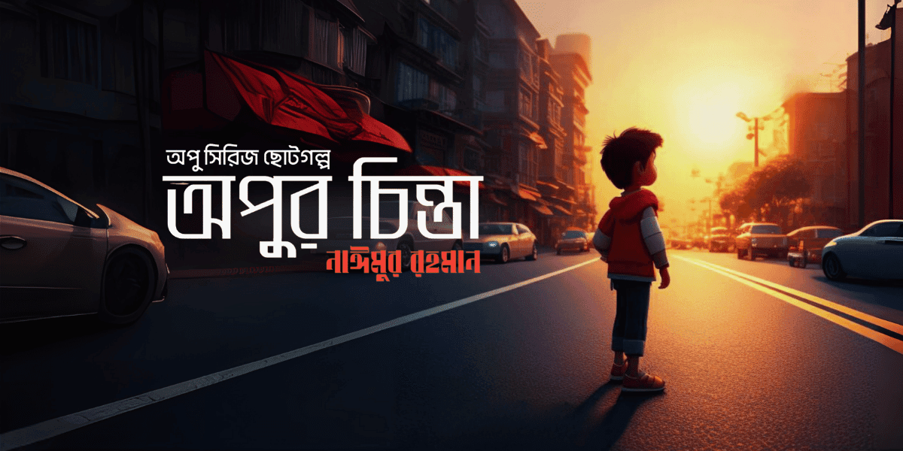

import FirstSubpost from '@/components/mdx/FirstSubpost.astro'

## গল্পের শুরুতে…

ছোটবেলায় বাড়ি থেকে পালিয়ে যাওয়ার চিন্তা—এই অনুভূতিটা অনেকের জীবনে একবার হলেও এসেছে। আমি নিজেও তার ব্যতিক্রম ছিলাম না। কখনও অভিমান, কখনও রাগ, কখনও শুধুই একটা কল্পনার টানে মনে হতো, “চলে যাই! কোথাও দূরে…”

সেই সময়কার একটা কল্পনার জগৎ ঘিরেই একদিন লিখে ফেলেছিলাম একটা গল্প—**"পথশিশু অপু"**। তখন লেখার অভ্যাস ছিল, বই পড়া কম, অভিজ্ঞতা প্রায় নেই বললেই চলে। কিন্তু মনের মধ্যে যে গল্পগুলো ঘুরে বেড়াত, সেগুলোই কাগজে তুলে ধরার চেষ্টা করতাম।

## পুরোনো অভ্যাসের ফিরে আসা

অনেকদিন পর হঠাৎ করে সেই পুরোনো লেখা হাতে এলো। পড়তে গিয়ে মনে হলো—এই গল্পগুলো তো একান্ত নিজের, নিজের ছোটবেলার আয়নায় দেখা কিছু স্বপ্ন। তাই ভাবলাম, ধীরে ধীরে সেগুলো আবার প্রকাশ করি।

লেখাগুলোর মধ্যে ভুলত্রুটি থাকতেই পারে, কিন্তু সেগুলো সেই বয়সের নির্ভেজাল কল্পনা থেকেই জন্ম নিয়েছিল।

## প্রকাশিত পর্বগুলো

🔗 **[অপু-০৩: পথশিশু অপু](https://blog.mnr.world/2025/07/opu-03-Pothoshishu-Opu.html)**  
(নতুন প্রকাশিত পর্ব)

পূর্ববর্তী পর্বগুলো:

- 🔗 **[অপু-০১: অপুর চিন্তা](https://blog.mnr.world/2025/01/opu-01-chinta.html)**
- 🔗 **[অপু-০২: বৃষ্টির স্মৃতি](https://blog.mnr.world/2025/04/opu-02-rain.html)**

## একান্ত অনুরোধ

যদি সময় পান, পড়ে দেখতে পারেন। মন্তব্যে জানালে ভালো লাগবে—লেখাগুলো আপনাদের কেমন লাগল। ❤️

<FirstSubpost
  title="অপু-০৩: পথশিশু অপু"
  href="/blog/opu-series/opu-03-pothoshishu-opu"
/>
