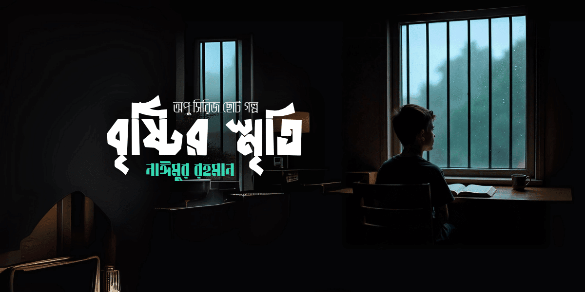

import FirstSubpost from '@/components/mdx/FirstSubpost.astro'

## বৃষ্টির স্মৃতি

কয়েক ঘণ্টা যাবৎ মুষলধারে বৃষ্টি হচ্ছে। না কমছে, না বাড়ছে।  
বৃষ্টির জন্য কেউ ছুটাছুটি করে ছাদ থেকে আর গ্রামের উঠোন থেকে কাপড় তুলছে।  
কেউ আবার পানিতে না ভেজার জন্য মাথায় ছাতা দিয়ে হাঁটছে।  
কেউ আবার একটা কচুপাতার উপর নির্ভর করছে।  
আবার কেউ তার অতিপ্রিয় বইটা মাথায় দিয়ে বৃষ্টির পানি থেকে মাথা আড়াল করার চেষ্টা করছে।  
যারা কোনো ছাদের নিচে দাঁড়িয়ে আছে, তারা ভিজতে থাকা মানুষগুলোকে দেখে ঠাট্টা-মশকরা করছে।  
কেউ মোবাইলের সাহায্যে জানাচ্ছে—সে যেতে পারবে না, তার খবর পরিবার-পরিজনকে দিচ্ছে।

চতুর্দিকের মানুষ ব্যস্ত।  
শুধু ব্যস্ত নেই অপু।  
সে ব্যস্ত থাকবেই বা কী করে?  
সে তো জানালার ধারে বসে পানি পড়া দেখছে।  
পানি পড়ছে। এটা আবার দেখার কী হলো?  
অপুকে যদিওবা দেখলে মনে হবে সে পানি পড়া দেখছে, কিন্তু প্রকৃতপক্ষে সে পানি পড়া দেখছে না।  
সে তার কল্পনার চোখ দিয়ে তার অতীত দেখছে।  
আসলে এই কথাটি হয়তো সঠিক—**যা যায় ভালো, যা আসে খারাপ।**

---

একটি ফাঁকা মাঠ। পানিতে ভিজছে।  
ভিজছে কাবাডি কোর্টটাও। ভিজছে ভলিবল খেলার অংশ।  
ভিজছে প্রাত্যহিক সমাবেশের অংশটা। ভিজছে বড়ই গাছ থাকার অংশটি।  
পুকুরে পানি পড়ছে, অনেক সুন্দর লাগছে। বিষয়গুলো অতি স্বাভাবিক।

বেশিদিন নয়। মাত্র এক বছর আগে এই কাবাডি কোর্টে টেনিস বল দিয়ে ফুটবল খেলছিল অপু।  
অন্যান্য খেলোয়াড়দের মতো সেও বিদ্যালয়ের পোশাক পরিধানরত অবস্থায়।  
শুধু পার্থক্যটা হচ্ছে—অপুর পোশাক একদম সুশৃঙ্খল।  
বিদ্যালয়ের নিয়ম অনুযায়ী সে সবকিছু রেখেছে।  
তাই অনেক দূর থেকেও, এমনকি বিদ্যালয়ের ৩য় তলা থেকেও তাকে দেখে বোঝা যাচ্ছে যে ওটা অপু।

---

স্বভাবতই **জেতা** সকলের নেশা।  
অপু আবার তার থেকে বাদ যাবে কেন? সেও জেতার জন্য খেলছে।  
শুধু কাবাডি কোর্টে নয়, ভলিবলের মাঠেও ছোট টেনিস বল দিয়ে অপুরা খেলে।  
এত বড় মাঠ! তাই অল্পতেই হাপিয়ে যাওয়া কোনো অস্বাভাবিক বিষয় নয়।  
তবে একটু বেশি হাপিয়ে যায় অপু।  
তার দম অত্যন্ত কম।  
তবে সে ১–২ মিনিটে যা করতে পারে, তা অন্য কেউ আধা ঘণ্টায়ও করতে পারে না।

পড়ে গেলে উঠে দাঁড়ানো, ঘুরতে ঘুরতে খেলা চালিয়ে যাওয়া,  
কখনো কখনো ‘ফাউল’ না ধরে নিজেকে নিয়ন্ত্রণ করা—এই সবই অপুর স্বভাব।

---

তাদের মাঠের পাশে ছিল একটা পুকুর,  
আর তার পাশেই ছিল অনেক স্মৃতির গাছ, পথ, মাঠ।  
সেখানে অপু আর তার বন্ধুরা গল্প করত।  
কিছু সত্যি, কিছু মিথ্যা—কিন্তু সবাই শুনত হাসিমুখে।

গল্পের মাঝে হঠাৎ চলে আসত খেলাধুলা—  
পুকুর পাড়েই গাছগুলো প্রাকৃতিক কাবাডি কোর্ট বানিয়ে দিত।  
একটা বাঁকা গাছ, তিনটি গোলবার গাছ,  
আর একটি বড়ই গাছ—যার চারপাশে প্রতিদিন ঘুরে চলত অপুর স্কুলজীবন।

কিন্তু এখন নেই সেই বড়ই গাছ।  
ঝড়ে ভেঙে গেছে।

---

তখন অপু দাঁড়িয়ে জানালার পাশে।  
চোখে পানি, মনে স্মৃতি।  
আর ঠিক সেই সময়—কে যেন ডাক দেয় অপুকে।  
অপু চোখ মুছতে মুছতে সেদিকে চলে যায়…

---

### 📝 তথ্য

- **গল্পের নাম** : বৃষ্টির স্মৃতি
- **ধরণ** : স্মৃতিচারণ
- **সংগ্রহ** : অপু সিরিজ ছোটগল্প
- **লেখক** : নাঈমুর রহমান

<FirstSubpost
  title="অপু-০৩: পথশিশু অপু"
  href="/blog/mnr-opu-series/mnr-opu-03"
/>
